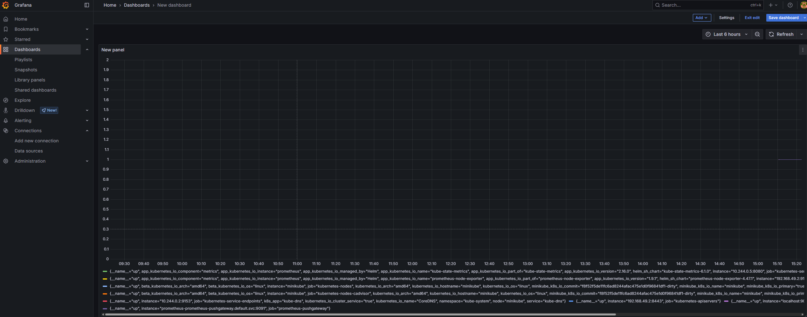

# Riaan's Portfolio Site

This is a simple Node.js + Express portfolio website to showcase my past projects.

## 🛠 Tech Stack
- Node.js
- Express
- HTML/CSS

## 📌 Project Structure
- `/views`: HTML pages
- `/public`: Static files (CSS)
- `/routes`: Routing logic
- `app.js`: Main app file

## 📈 SDLC Model
We are using **Agile Kanban**. Tasks are tracked in the GitHub Project board.

## 🧪 Features (WIP)
- Static homepage
- Project links
- Health check route

## 💻 Local Development

```bash
npm install
node app.js
## 🐳 Running with Docker

### Build the image:
```bash
docker build -t riaan-portfolio .

## 🚀 CI/CD Pipeline (Automated Deployment via Jenkins)

This project uses a Jenkins-based CI/CD pipeline to automatically build, publish, and deploy the Node.js portfolio application using Docker and Helm.

### 📦 Pipeline Stages

1. **Build**  
   Jenkins uses the `Dockerfile` to build a production-ready image of the portfolio app.

2. **Push to Docker Hub**  
   The Docker image is pushed to Docker Hub using secure credentials.

3. **Deploy via Helm on Minikube**  
   Jenkins uses Helm to deploy the Docker image into a local Kubernetes cluster (Minikube).

---

### 🛠️ Tools & Technologies

| Tool        | Purpose                             |
|-------------|-------------------------------------|
| **Jenkins** | CI/CD orchestration                 |
| **Docker**  | Containerization of the Node.js app |
| **Helm**    | Kubernetes deployment templating    |
| **Minikube**| Local Kubernetes cluster            |
| **GitHub**  | Source code and Jenkinsfile repo    |

---

### 🔐 Credentials Management

- **Docker Hub Login**  
  Managed using a Jenkins credential with ID: `dockerhub-creds`  
  (Stored securely via Jenkins Credential Manager)

- **GitHub Access**  
  If the repo is private, GitHub credentials can also be stored in Jenkins under a global credential and referenced during job setup.

---

### 🧭 CI/CD Flow Diagram (Text Version)

```text
[GitHub Repo] 
     │
     ▼
[Jenkins Pipeline]
     ├── Stage 1: Build Docker Image
     ├── Stage 2: Push to Docker Hub
     └── Stage 3: Deploy via Helm to Minikube

## 🔐 Security Hardening
📄 [View ZAP Report](./docs/zap-scan-report.html)

### Tools Used:
- [Helmet](https://www.npmjs.com/package/helmet) for HTTP security headers
- Self-signed SSL certificate via OpenSSL for HTTPS
- `npm audit` for static security analysis (SAST)
- [OWASP ZAP](https://owasp.org/www-project-zap/) for dynamic security analysis (DAST)

### Summary:
- HTTPS enabled on `https://localhost:3443`
- All audit results show 0 vulnerabilities
- Helmet automatically configures common security headers
- OWASP ZAP used to test runtime vulnerabilities like XSS and CSP


## 🔐 Phase 5: Security Hardening

### 🔎 SAST Scan (Static Analysis)
- **Tool Used**: `npm audit`
- **Result**: ✅ No vulnerabilities found in dependencies.

### 🛡️ DAST Scan (Dynamic Testing)
- **Tool Used**: OWASP ZAP 2.16.1
- **Target**: https://localhost:3443
- **Findings Summary**:
  - **Total Alerts**: 7
    - 🟠 Medium Risk: 3
    - 🟡 Low Risk: 3
    - ⚪ Informational: 1

### ⚠️ Key Issues Identified:
| Risk | Issue |
|------|-------|
| 🟠 Medium | CSP: Missing fallback directives |
| 🟠 Medium | CSP: Wildcard directive present |
| 🟠 Medium | CSP: `style-src 'unsafe-inline'` |
| 🟡 Low | Missing Strict-Transport-Security header |
| 🟡 Low | X-Content-Type-Options header missing |
| 🟡 Low | Server leaks info via `X-Powered-By` |
| ⚪ Info | Weak Cache-Control directives |

### 🛠️ Mitigations Implemented:
- [x] Used `helmet` middleware in Express:
  ```js
  const helmet = require('helmet');
  app.use(helmet());

  ## 📈 Monitoring Setup

We used **Prometheus + Grafana** to monitor the application running on Minikube.

- **Prometheus** scrapes app and container metrics
- **Grafana** visualizes the metrics in dashboards

**Setup Steps:**
- Installed Prometheus and Grafana using Helm
- Port-forwarded Grafana on `localhost:3000`
- Connected Prometheus as a data source
- Created a dashboard using the `up` metric to verify container status

> 

